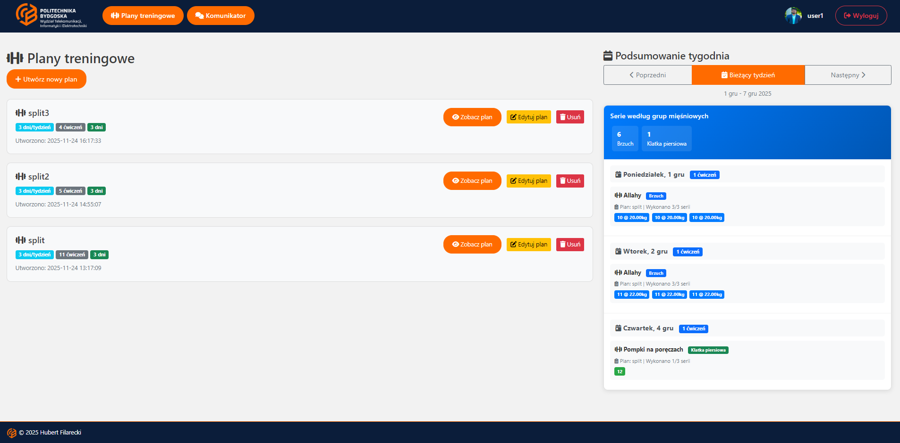
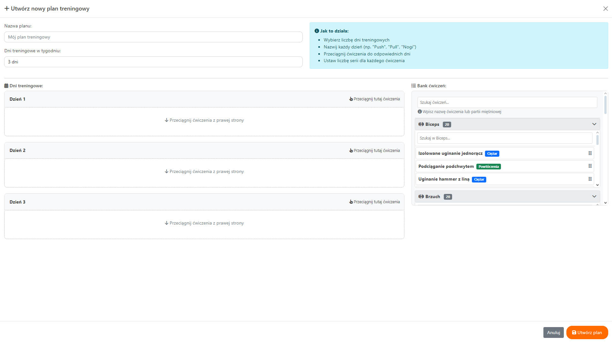
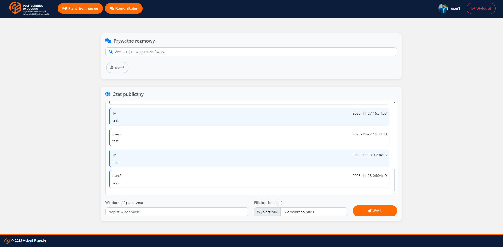
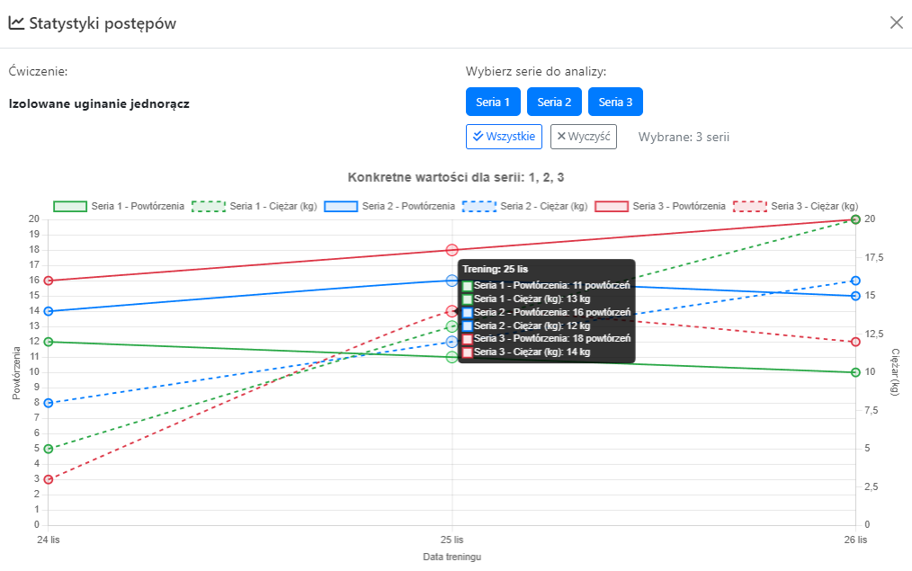
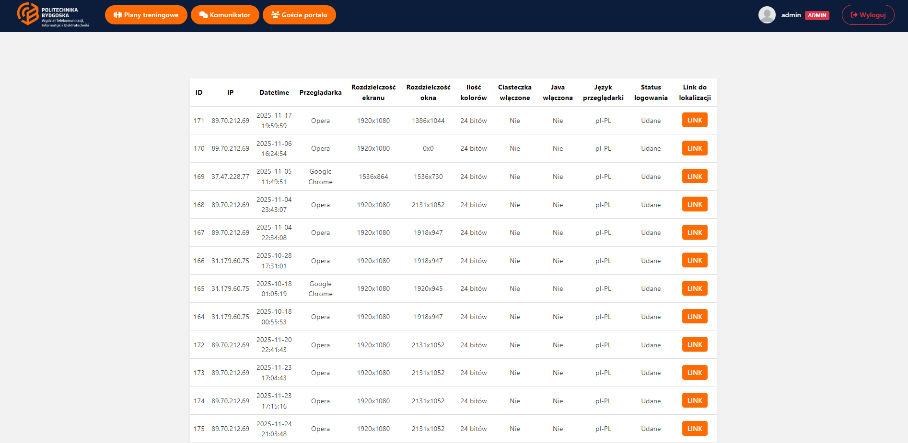

# Aplikacja do planowania treningów

Webowa aplikacja w PHP i MySQL do układania planów treningowych, śledzenia progresu i komunikacji między użytkownikami. Projekt powstał jako praca inżynierska — nacisk położony na funkcjonalności backendowe i praktyczną naukę budowania większych aplikacji webowych.

---

## Preview



### Galeria






---

## Demo

[Link do strony](https://hubfil.great-site.net/inz/logowanie.php)

> Demo na moim hostingu pozwala zobaczyć interfejs aplikacji.

**Dane logowania (demo):**

* Login: `user1`
* Hasło: `pass1`

---

## Funkcje

* Rejestracja i logowanie użytkowników
* System sesji i ról
* Tworzenie oraz edycja planów treningowych
* Historia treningów i śledzenie progresu
* Statystyki i wykresy postępów
* Prywatny komunikator między użytkownikami
* Publiczny chat
* Upload zdjęć i plików
* Panel administratora
* Logowanie aktywności użytkowników
* Responsywny interfejs (Bootstrap)

---

## Technologie

* Backend: PHP, MySQL / MariaDB
* Frontend: HTML5, CSS3, Bootstrap, JavaScript (AJAX)

---

## Uruchomienie lokalne

```bash
git clone https://github.com/hubertfilarecki/gym-training-app.git
```

1. Utwórz plik `.env` w głównym katalogu projektu.
2. Uzupełnij dane połączenia z bazą danych (wzór poniżej).
3. Zaimportuj schemat bazy MySQL.
4. Uruchom projekt na lokalnym serwerze PHP (XAMPP, Laragon itp.).

Przykładowy `.env`:

```env
DB_HOST=localhost
DB_PORT=3306
DB_NAME=twoja_baza
DB_USER=twoj_user
DB_PASSWORD=twoje_haslo
```

---

## Struktura projektu

```txt
app/
├── bootstrap/
└── helpers/

docs/
└── assets/

uploads/

plany.php
progres.php
komunikator.php
logowanie.php
rejestruj.php
```

---

## Bezpieczeństwo

* Dane dostępowe do bazy przechowywane lokalnie w `.env`
* Plik `.env` oraz katalog `uploads/` są wykluczone z repozytorium
* Repozytorium nie zawiera żadnych prywatnych danych ani sekretów

---

## Zakres i ograniczenia

Aplikacja powstawała bez frameworka MVC, dlatego część logiki pozostała w większych plikach. Priorytetem była funkcjonalność i nauka — nie pełna optymalizacja architektury. Pod koniec projektu przeprowadzony został częściowy refactor: wydzielenie helperów, uporządkowanie inicjalizacji i ograniczenie duplikacji kodu.

---

## Czego się nauczyłem

* Budowania aplikacji webowych w PHP od podstaw
* Pracy z MySQL i modelowania relacji w bazie danych
* Obsługi sesji i autoryzacji użytkowników
* Komunikacji AJAX bez przeładowywania strony
* Uploadu plików i walidacji danych po stronie serwera
* Organizacji i refactoru większego projektu PHP
* Tworzenia responsywnego interfejsu z Bootstrap

---

## Licencja

MIT
